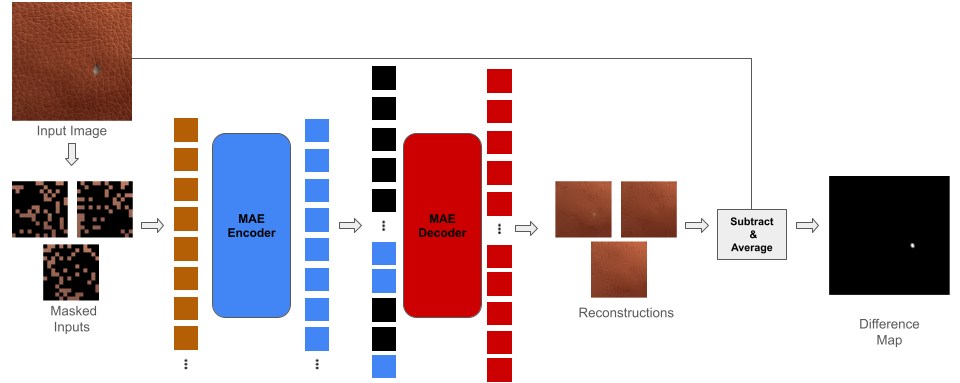
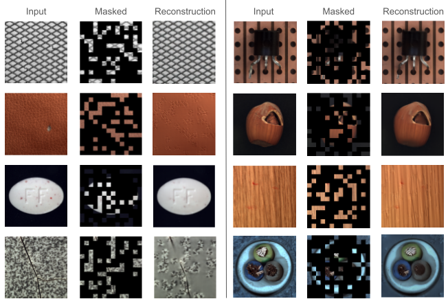
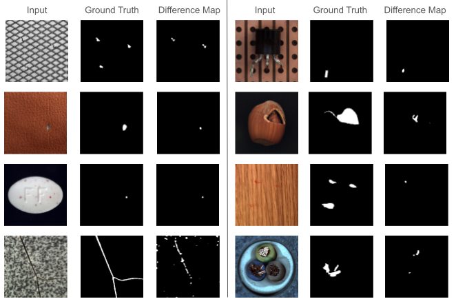

# UMAAD
<p align="center">
  
</p>

CS-GY 6953 Deep Learning Fall 2023

Professor Gustavo Sandoval

Authors: Kevin Lee, Kevin Zheng, James Ng

This is the implementation repo of UMAAD: Unsupervised Masked Autoencoder for Anomaly Detection

## How To Run

### Dependencies

Conda environment files are provided as `environment_linux.yml` and `environment_cross_platform.yml`.

Use the appropriate file based on your OS to install the needed dependencies.

### Pretrained Checkpoint

Note: In order to properly finetune this model, the checkpoint for the ImageNet-pretrained ViT-Large model used in this paper (which is not made available here in this repo) is needed.

You can download the model checkpoint using the following link:
```
https://dl.fbaipublicfiles.com/mae/visualize/mae_visualize_vit_large_ganloss.pth
```

### To finetune UMAAD:

    $ python trainer.py

The following are optional parameters that may be modified:

```
--seed        | "Random seed"                                  | default: 0
--ratio       | "Ratio of missing data"                        | default: 0.75
--lr          | "Learning rate"                                | default: 1e-3
--num_epochs  | "Number of epochs"                             | default: 50
--batch_size  | "Batch size"                                   | default: 32
--accum_iter  | "Number of iterations to accumulate gradients" | default: 1
--checkpoint  | "Path to checkpoint"                           | default: None
```

The default parameters were used to train the model described in the paper.

### To evaluate UMAAD:

To evaluate on the entire test set:

    $ python eval.py

To evaluate per object in test set:

    $ python eval_object.py

The following are optional parameters that may be modified for both scripts:

```
--seed        | "Random seed"                                  | default: 0
--checkpoint  | "Path to checkpoint"                           | default: None
--sigma       | "Sigma for Gaussian blur"                      | default: 1
```

## Reconstruction Samples
Examples of image reconstruction using Masked Autoencoders fine-tuned on MVTec dataset.
<p align="center">
  
</p>

## Anomaly Detection Demo
Examples of image anomaly detection using UMAAD.
<p align="center">
  
</p>

## Attributions

Some of the code present in this repository has been borrowed and modified from the official Masked Autoencoder implementation by Facebook AI Research.

A link to their license can be found [here](https://github.com/facebookresearch/mae/blob/main/LICENSE).
